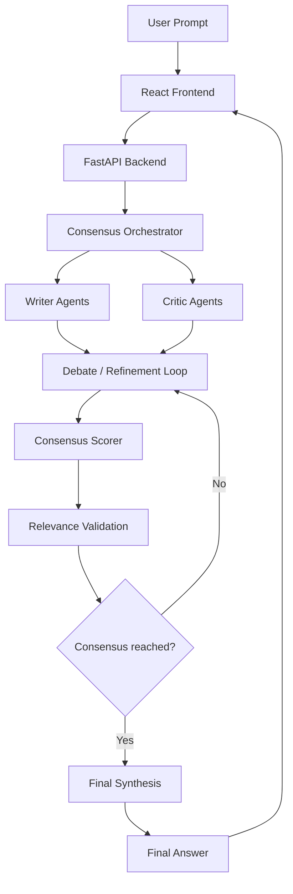

# Architecture

## High-Level Architecture

MultiAI uses a React frontend with a FastAPI backend.

The frontend is responsible for:
- configuring agent teams
- collecting prompts and attachments
- displaying debate activity
- rendering final answers and insights

The backend is responsible for:
- orchestrating debate workflows
- managing Writer/Critic agents
- calling OpenRouter models
- scoring agreement
- validating relevance
- summarizing rolling context
- tracking usage and costs
- persisting sessions

---

## System Flow



Rolling context summaries are used between rounds instead of full debate transcripts.  
Each round is compressed into a concise summary that is passed into subsequent debate iterations to reduce token usage and prevent context-window overflow.

## Debate Loop

```text
User submits question
  → Optional intent clarification step
  → Initial Writer response generated
  → Debate / refinement loop begins

      Critic agents review and challenge the current answer
      Consensus scorer evaluates agreement level
      Rolling summaries compress prior rounds into lightweight context
      Relevance validation checks alignment with the original task

      If agreement threshold is reached:
          stop debate loop

      Otherwise:
          Writer refines the answer and another round begins

  → Final synthesized answer generated
  → Session persisted locally
```

---

## Context Management

Rolling context summaries are used between rounds instead of full debate transcripts.

Each round is compressed into a lightweight summary that is passed into subsequent iterations. This reduces token usage, keeps context windows manageable, and improves orchestration scalability.

---

## Model Routing

Writer and Critic agents are user-configurable.

Consensus scoring and rolling-context summarization currently use fixed Deepseek models to ensure consistent evaluation behavior and lower operational cost.