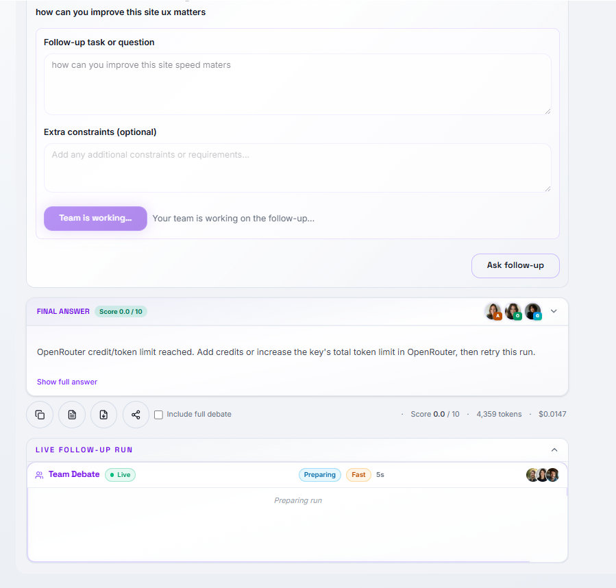
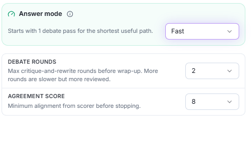
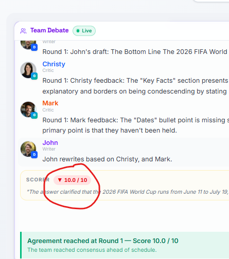
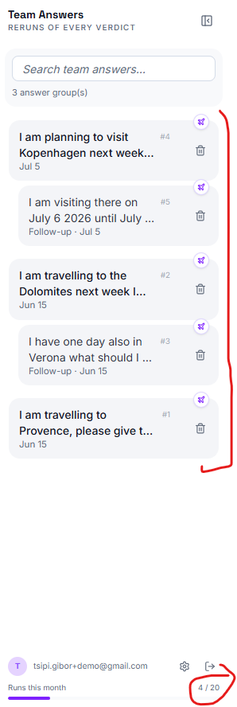
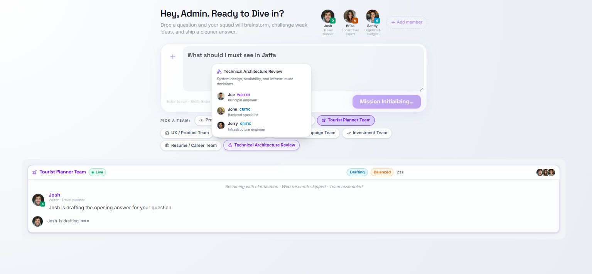
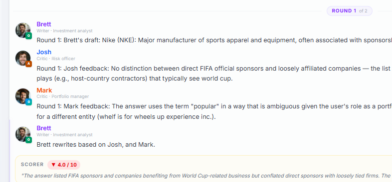

# Cleanup and Consistency Fixes — Ongoing

Items below were added after v4.3 shipped, used as a rough timestamp reference. This is a personal running list, separate from PLAN.md/ROADMAP.md.

## General follow-up items that are useful but not part of the active implementation plan.
---

1. check the docs\claude_suggestions\AUDIT_MAP.md - ## Inconsistencies and flags and see what should be solved
2. fix repetition of violet an too many styling properties (remove for exmple:
`# colors... inside the html
 border-[#ffffff08] 
 .bubble-writer  { background-color: color-mix(in srgb, #d8f5d4 86%, var(--card)); }
  doc.setTextColor(130, 100, 190);
  `
 3. Check the drawParticipants why is it setting the fonts etc... isn't there a better way to write the exporter.ts

 4. When follow up quesstion live debate the main section containing the whole question text area and pick a team all disapear I would like it to behave same as non follow up question

 5. make the Team Template drawer use the same styling conventions for the "Writer/critics, roles and llm badge for each team member
 
 6. Optional Utility Model Benchmarking

    Consider benchmarking faster OpenRouter options for scorer, summarizer, validator, and intent assessment only if real production runs show that utility calls are still a meaningful source of latency or cost after v4.3.

    This is not required for v4.3 because utility models are already configurable through environment variables, and Session Insights records per-model call count, cost, and latency.

    When it becomes useful, compare candidate utility models on:

    - Response latency for the same representative prompts
    - Cost per call and total run cost
    - Reliability of strict formats such as `SCORE:` / `REASON:`
    - Quality of scoring, validation, summary, and clarification decisions
    - Compatibility with current OpenRouter model IDs and Railway configuration

 7. Run a full unused-file / dead-code audit across frontend/src — not just files claimed-deleted in
    plan docs (see docs/plan_archive/PLAN_Tests.md for the narrower, plan-doc-driven check already
    done). Low priority, not urgent.

 8. Recheck again the Follow up question flow and fix it 
      - check what if team is being changed on follow-up question
      - constraint text area of the follow up

 9. Recheck the session counters 

 10. When hebrew asks for web search

 11. recheck the Fast/balanced if work as defined - 

 12. score in red when get 10/10 

 13. fix Runs this month 

14. When question submitted "Pick a Team should be also disabled not letting the user change it in the middle of mission initializing or when question delivered 

15. There is no need for "Round 1 on each of the personas 